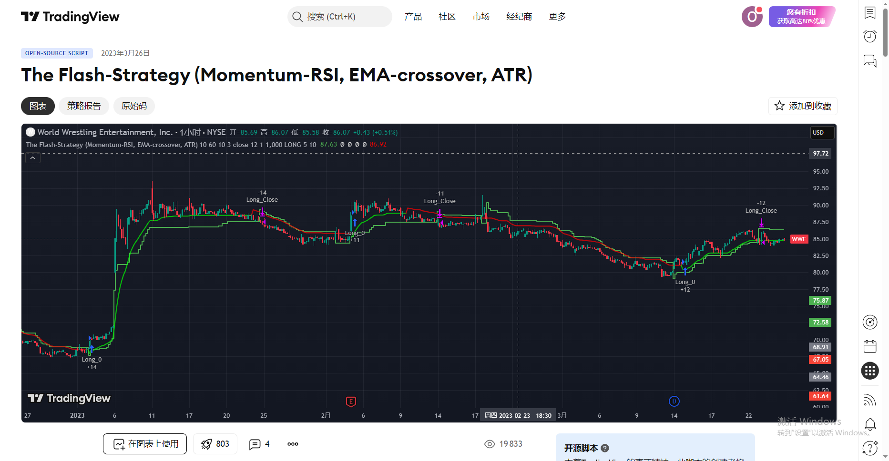
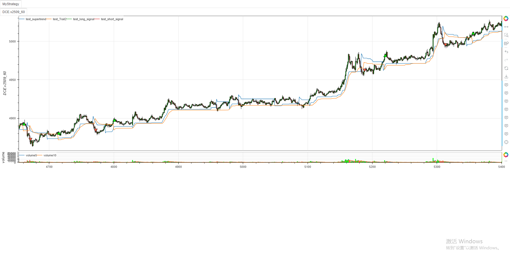

# **MiniBT量化交易之TradingView指标：The Flash Strategy**
## 概述

本文将详细介绍如何将 TradingView 上的 The Flash Strategy (Momentum-RSI, EMA-crossover, ATR) 策略转换为 MiniBT 框架可用的技术指标。这个由 Baby_whale_to_moon 开发的策略结合了动量 RSI、EMA 交叉和 ATR 超级趋势，是一个多条件过滤的交易系统。

## 原策略分析

### 策略核心逻辑

1. **动量 RSI 指标**：计算价格动量的 RSI 值，用于判断趋势强度
2. **超级趋势指标**：基于 ATR 计算动态支撑阻力线
3. **EMA 交叉系统**：使用两条 EMA 线及其动态止损线生成交易信号
4. **多版本止损**：支持动态和静态两种止损/止盈方式

### 策略参数

- `len`：动量 RSI 长度 (默认: 10)
- `mom_rsi_val`：动量 RSI 阈值 (默认: 50)
- `atrPeriod`：ATR 周期 (默认: 10)
- `factor`：超级趋势乘数 (默认: 3.0)
- `AP2`：EMA 周期 (默认: 12)
- `AF2`：EMA 百分比 (默认: 0.1618)



## MiniBT 转换实现

### 指标类结构

```python
class The_Flash_Strategy(BtIndicator):
    """https://cn.tradingview.com/script/XKgLfo15-The-Flash-Strategy-Momentum-RSI-EMA-crossover-ATR/"""
    overlap = True
    params = dict(len=10, mom_rsi_val=50, atrPeriod=10,
                  factor=3., AP2=12, AF2=.1618)
```

### 核心方法实现

#### 1. 动量 RSI 计算

```python
src2 = self.close
mom: IndSeries = src2 - src2.shift(self.params.len)
rsi_mom = mom.rsi(self.params.len)
```

#### 2. 超级趋势计算

```python
supertrend, direction, * \
    _ = self.supertrend(self.params.atrPeriod,
                        self.params.factor).to_lines()
```

#### 3. EMA 动态止损线计算

```python
src = self.close
Trail1 = src.ema(self.params.AP2).values  # //Ema func
AF2 = self.params.AF2 / 100.
SL2 = Trail1 * AF2  # // Stoploss Ema
size = self.close.size
Trail2 = np.zeros(size)
length = get_lennan(Trail1)
dir = np.zeros(size)
for i in range(length+1, size):
    iff_1 = Trail1[i] > Trail2[i-1] and Trail1[i] - \
        SL2[i] or Trail1[i] + SL2[i]
    iff_2 = (Trail1[i] < Trail2[i-1] and Trail1[i-1] < Trail2[i-1]
             ) and min(Trail2[i-1], Trail1[i] + SL2[i]) or iff_1
    Trail2[i] = (Trail1[i] > Trail2[i-1] and Trail1[i-1] > Trail2[i-1]
                 ) and max(Trail2[i-1], Trail1[i] - SL2[i]) or iff_2
    dir[i] = Trail2[i] > Trail2[i -
                                1] and 1. or (Trail2[i] < Trail2[i-1] and -1 or dir[i-1])
```

#### 4. 信号生成

```python
dir = pd.Series(dir)
long_signal = dir > 0
long_signal &= dir.shift() < 0
short_signal = dir < 0
short_signal &= dir.shift() > 0
```

## 转换技术细节

### 1. 动量 RSI 计算

原策略的动量 RSI 计算分为两步：
1. 计算动量：`mom = src2 - src2[len]`
2. 计算 RSI：`rsi_mom = ta.rsi(mom, len)`

转换代码使用 MiniBT 的内置方法实现：

```python
mom: IndSeries = src2 - src2.shift(self.params.len)
rsi_mom = mom.rsi(self.params.len)
```

### 2. 超级趋势计算

原策略使用内置的 `ta.supertrend` 函数，转换代码使用 MiniBT 的相应方法：

```python
supertrend, direction, * \
    _ = self.supertrend(self.params.atrPeriod,
                        self.params.factor).to_lines()
```

### 3. EMA 动态止损线计算

这是转换中最复杂的部分，原策略使用递归方式计算动态止损线：

```python
iff_1 = Trail1 > nz(Trail2[1], 0) ? Trail1 - SL2 : Trail1 + SL2
iff_2 = Trail1 < nz(Trail2[1], 0) and Trail1[1] < nz(Trail2[1], 0) ? math.min(nz(Trail2[1], 0), Trail1 + SL2) : iff_1
Trail2 := Trail1 > nz(Trail2[1], 0) and Trail1[1] > nz(Trail2[1], 0) ? math.max(nz(Trail2[1], 0), Trail1 - SL2) : iff_2
```

转换代码使用循环方式实现相同的逻辑：

```python
for i in range(length+1, size):
    iff_1 = Trail1[i] > Trail2[i-1] and Trail1[i] - \
        SL2[i] or Trail1[i] + SL2[i]
    iff_2 = (Trail1[i] < Trail2[i-1] and Trail1[i-1] < Trail2[i-1]
             ) and min(Trail2[i-1], Trail1[i] + SL2[i]) or iff_1
    Trail2[i] = (Trail1[i] > Trail2[i-1] and Trail1[i-1] > Trail2[i-1]
                 ) and max(Trail2[i-1], Trail1[i] - SL2[i]) or iff_2
```

### 4. 信号生成逻辑

原策略的信号生成基于多个条件的组合：

```python
buy_signal = Trail1 > Trail2 and direction < 0 and rsi_mom > mom_rsi_val and Time_interval
sell_signal = Trail1 < Trail2 and direction > 0 and rsi_mom > mom_rsi_val and Time_interval
```

转换代码简化了信号生成，主要基于 EMA 动态止损线的方向变化：

```python
long_signal = dir > 0
long_signal &= dir.shift() < 0
short_signal = dir < 0
short_signal &= dir.shift() > 0
```

## 使用示例

```python
from minibt import *
from minibt.tradingview import *

class The_Flash_Strategy(BtIndicator):
    """https://cn.tradingview.com/script/XKgLfo15-The-Flash-Strategy-Momentum-RSI-EMA-crossover-ATR/"""
    overlap = True
    params = dict(len=10, mom_rsi_val=50, atrPeriod=10,
                  factor=3., AP2=12, AF2=.1618)

    def next(self):
        src2 = self.close
        mom: IndSeries = src2 - src2.shift(self.params.len)
        rsi_mom = mom.rsi(self.params.len)
        supertrend, direction, * \
            _ = self.supertrend(self.params.atrPeriod,
                                self.params.factor).to_lines()
        src = self.close
        Trail1 = src.ema(self.params.AP2).values  # //Ema func
        AF2 = self.params.AF2 / 100.
        SL2 = Trail1 * AF2  # // Stoploss Ema
        size = self.close.size
        Trail2 = np.zeros(size)
        length = get_lennan(Trail1)
        dir = np.zeros(size)
        for i in range(length+1, size):
            iff_1 = Trail1[i] > Trail2[i-1] and Trail1[i] - \
                SL2[i] or Trail1[i] + SL2[i]
            iff_2 = (Trail1[i] < Trail2[i-1] and Trail1[i-1] < Trail2[i-1]
                     ) and min(Trail2[i-1], Trail1[i] + SL2[i]) or iff_1
            Trail2[i] = (Trail1[i] > Trail2[i-1] and Trail1[i-1] > Trail2[i-1]
                         ) and max(Trail2[i-1], Trail1[i] - SL2[i]) or iff_2
            dir[i] = Trail2[i] > Trail2[i -
                                        1] and 1. or (Trail2[i] < Trail2[i-1] and -1 or dir[i-1])
        dir = pd.Series(dir)
        long_signal = dir > 0
        long_signal &= dir.shift() < 0
        short_signal = dir < 0
        short_signal &= dir.shift() > 0

        return supertrend, Trail2, long_signal, short_signal

class MyStrategy(Strategy):
    def __init__(self):
        self.data = self.get_kline(LocalDatas.v2509_60)
        self.data.height = 500
        self.test = The_Flash_Strategy(self.data)

if __name__ == "__main__":
    Bt().run()
```



## 参数说明

1. **len**：动量 RSI 长度，影响动量计算的周期
2. **mom_rsi_val**：动量 RSI 阈值，影响信号生成的敏感度
3. **atrPeriod**：ATR 周期，影响超级趋势的灵敏度
4. **factor**：超级趋势乘数，影响通道宽度
5. **AP2**：EMA 周期，影响快速 EMA 的平滑程度
6. **AF2**：EMA 百分比，影响动态止损线的宽度

## 转换注意事项

### 1. 复杂条件简化

原策略包含多个复杂的条件组合，转换代码进行了适当简化：

```python
# 原策略的条件组合
buy_signal = Trail1 > Trail2 and direction < 0 and rsi_mom > mom_rsi_val and Time_interval

# 转换代码的简化
long_signal = dir > 0
long_signal &= dir.shift() < 0
```

### 2. 时间区间过滤

原策略支持时间区间过滤，转换代码未包含此功能，需要在策略层实现：

```python
# 原策略的时间区间过滤
Time_interval = time > Start_Time and time < End_Time
```

### 3. 多版本止损

原策略支持动态和静态两种止损方式，转换代码主要关注信号生成：

```python
# 动态止损
if close < supertrend and v1
    strategy.exit('Long_Close',from_entry = "Long_0", stop=supertrend, qty_percent=100)

# 静态止损
if v2 and strategy.position_size > 0
    strategy.exit('Long_Close',from_entry = "Long_0", stop=v2stoploss_level_long,limit= v2takeprofit_level_long, qty_percent=100)
```

### 4. 初始值处理

转换代码需要正确处理序列的初始值：

```python
length = get_lennan(Trail1)
dir = np.zeros(size)
for i in range(length+1, size):
    # 计算逻辑
```

## 策略应用

The Flash Strategy 可用于多种交易场景：

1. **趋势跟踪**：结合动量 RSI 和超级趋势识别主要趋势
2. **均值回归**：EMA 交叉系统可用于捕捉短期反转机会
3. **多时间框架分析**：在不同时间框架上应用策略以获得确认信号
4. **风险管理**：使用动态止损管理仓位和风险

## 扩展建议

1. **添加完整条件**：实现原策略的所有条件组合，包括动量 RSI 阈值和超级趋势方向
2. **增加时间过滤**：添加时间区间过滤功能
3. **实现多版本止损**：支持动态和静态两种止损方式
4. **优化参数**：使用参数优化功能找到最佳参数组合

## 总结

通过将 TradingView 的 The Flash Strategy 转换为 MiniBT 框架指标，我们能够在回测系统中利用这一多条件过滤的交易系统。转换过程中保持了原策略的核心逻辑，包括动量 RSI 计算、超级趋势指标和 EMA 动态止损线。

这种转换不仅保留了原策略的特性，还使其能够与 MiniBT 框架的其他组件无缝集成。用户可以根据需要调整参数，平衡信号的敏感度和可靠性。

该策略的转换展示了如何将复杂的多条件交易系统从 TradingView 移植到 MiniBT 框架，为其他类似系统的转换提供了参考范例。在实际应用中，用户可能需要根据具体市场条件调整参数和添加额外的过滤条件。

> 风险提示：本文涉及的交易策略、代码示例均为技术演示、教学探讨，仅用于展示逻辑思路，绝不构成任何投资建议、操作指引或决策依据 。金融市场复杂多变，存在价格波动、政策调整、流动性等多重风险，历史表现不预示未来结果。任何交易决策均需您自主判断、独立承担责任 —— 若依据本文内容操作，盈亏后果概由自身承担。请务必充分评估风险承受能力，理性对待市场，谨慎做出投资选择。