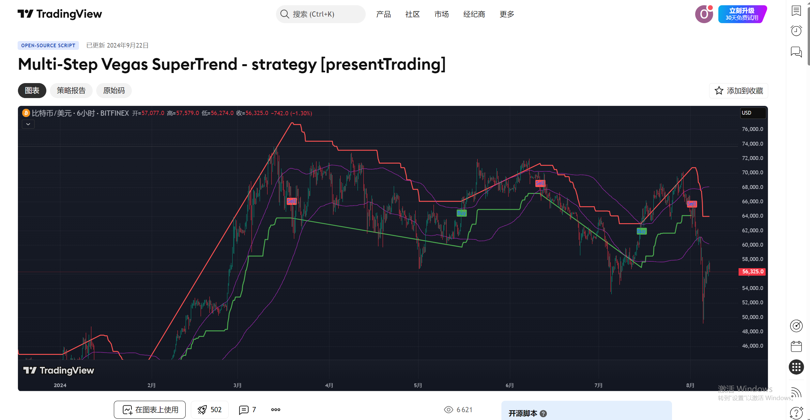
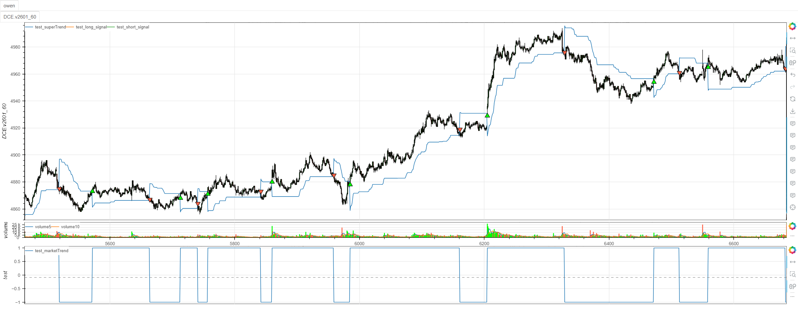

# **MiniBT量化交易之TradingView指标：Multi-Step Vegas SuperTrend Strategy**

## 概述

本文将详细介绍如何将 TradingView 上的 Multi-Step Vegas SuperTrend Strategy 策略转换为 MiniBT 框架可用的技术指标。这个策略结合了 Vegas 通道和 SuperTrend 指标，通过动态调整 SuperTrend 乘数来适应市场波动性变化，是一个自适应性的趋势跟踪系统。

## 原策略分析

### 策略核心逻辑

1. **Vegas 通道系统**：基于移动平均线和标准差构建动态通道
2. **自适应 SuperTrend**：根据 Vegas 通道宽度动态调整 SuperTrend 乘数
3. **多步骤过滤**：结合通道突破和趋势方向确认
4. **波动率调整**：市场波动率变化时自动调整策略灵敏度

### 策略参数

- `atrPeriod`：ATR 周期 (默认: 10)
- `vegasWindow`：Vegas 通道窗口 (默认: 100)
- `superTrendMultiplier`：SuperTrend 基础乘数 (默认: 5)
- `volatilityAdjustment`：波动率调整系数 (默认: 5)
- `matype`：均线类型 (默认: "jma")



## MiniBT 转换实现

### 指标类结构

```python
class Multi_Step_Vegas_SuperTrend_strategy(BtIndicator):
    """https://cn.tradingview.com/script/SXtas3lS-Multi-Step-Vegas-SuperTrend-strategy-presentTrading/"""
    params = dict(atrPeriod=10, vegasWindow=100,
                  superTrendMultiplier=5, volatilityAdjustment=5, matype="jma")
    overlap = dict(superTrend=True, marketTrend=False)
```

### 核心方法实现

#### 1. Vegas 通道计算

```python
vegasMovingAverage: IndSeries = getattr(
    self.close, self.params.matype)(self.params.vegasWindow)
# // Calculate the standard deviation for the Vegas Channel
vegasChannelStdDev = self.close.stdev(self.params.vegasWindow)

# // Upper and lower bands of the Vegas Channel
vegasChannelUpper = vegasMovingAverage + vegasChannelStdDev
vegasChannelLower = vegasMovingAverage - vegasChannelStdDev
```

#### 2. 自适应乘数调整

```python
# // Adjust the SuperTrend multiplier based on the width of the Vegas Channel.
channelVolatilityWidth = vegasChannelUpper - vegasChannelLower
adjustedMultiplier = self.params.superTrendMultiplier + \
    self.params.volatilityAdjustment * \
    (channelVolatilityWidth / vegasMovingAverage)
```

#### 3. SuperTrend 计算

```python
# // Calculate the SuperTrend indicator values.
averageTrueRange = self.atr(self.params.atrPeriod)
superTrendUpper_ = (
    self.hlc3() - (adjustedMultiplier * averageTrueRange)).values
superTrendLower_ = (
    self.hlc3() + (adjustedMultiplier * averageTrueRange)).values
```

#### 4. 趋势方向判断

```python
# // Update SuperTrend values and determine the current trend direction.
marketTrend[i] = (close[i] > superTrendPrevLower) and 1 or (
    (close[i] < superTrendPrevUpper) and -1 or marketTrend[i-1])
```

#### 5. 信号生成

```python
long_signal = marketTrend == 1
long_signal &= np.append([0], marketTrend[:-1]) == -1
short_signal = marketTrend == -1
short_signal &= np.append([0], marketTrend[:-1]) == 1
```

## 转换技术细节

### 1. Vegas 通道计算

原策略使用移动平均线和标准差构建动态通道：

```python
// Vegas Moving Average
vegasMovingAverage = ta.ema(close, vegasWindow)

// Calculate the standard deviation for the Vegas Channel
vegasChannelStdDev = ta.stdev(close, vegasWindow)

// Upper and lower bands of the Vegas Channel
vegasChannelUpper = vegasMovingAverage + vegasChannelStdDev
vegasChannelLower = vegasMovingAverage - vegasChannelStdDev
```

转换代码使用 MiniBT 的内置方法实现：

```python
vegasMovingAverage: IndSeries = getattr(
    self.close, self.params.matype)(self.params.vegasWindow)
vegasChannelStdDev = self.close.stdev(self.params.vegasWindow)
vegasChannelUpper = vegasMovingAverage + vegasChannelStdDev
vegasChannelLower = vegasMovingAverage - vegasChannelStdDev
```

### 2. 自适应乘数调整

这是该策略的核心创新点，根据市场波动率动态调整 SuperTrend 乘数：

```python
// Adjust the SuperTrend multiplier based on the width of the Vegas Channel.
channelVolatilityWidth = vegasChannelUpper - vegasChannelLower
adjustedMultiplier = superTrendMultiplier + volatilityAdjustment * (channelVolatilityWidth / vegasMovingAverage)
```

转换代码保持了相同的数学逻辑：

```python
channelVolatilityWidth = vegasChannelUpper - vegasChannelLower
adjustedMultiplier = self.params.superTrendMultiplier + \
    self.params.volatilityAdjustment * \
    (channelVolatilityWidth / vegasMovingAverage)
```

### 3. SuperTrend 计算

原策略使用标准的 SuperTrend 计算方式：

```python
[superTrend, direction] = ta.supertrend(factor, atrPeriod)
```

转换代码手动实现了 SuperTrend 计算：

```python
averageTrueRange = self.atr(self.params.atrPeriod)
superTrendUpper_ = (
    self.hlc3() - (adjustedMultiplier * averageTrueRange)).values
superTrendLower_ = (
    self.hlc3() + (adjustedMultiplier * averageTrueRange)).values
```

### 4. 趋势方向判断逻辑

原策略使用递归方式更新趋势方向：

```python
dir = 1
dir := nz(dir[1], dir)
superTrendUpper = dir == -1 and math.min(superTrendUpper, nz(superTrendUpper[1])) or superTrendUpper
superTrendLower = dir == 1 and math.max(superTrendLower, nz(superTrendLower[1])) or superTrendLower
dir := close > superTrendLower ? 1 : close < superTrendUpper ? -1 : dir
```

转换代码使用循环方式实现相同的逻辑：

```python
for i in range(lennan+1, size):
    marketTrend[i] = (close[i] > superTrendPrevLower) and 1 or (
        (close[i] < superTrendPrevUpper) and -1 or marketTrend[i-1])
    superTrendUpper[i] = (marketTrend[i] == 1) and max(
        superTrendUpper_[i], superTrendPrevUpper) or superTrendUpper_[i]
    superTrendLower[i] = (marketTrend[i] == -1) and min(
        superTrendLower_[i], superTrendPrevLower) or superTrendLower_[i]
```

### 5. 信号生成机制

原策略在趋势转换点生成交易信号：

```python
longCondition = dir == 1 and dir[1] == -1
shortCondition = dir == -1 and dir[1] == 1
```

转换代码使用 NumPy 数组操作实现：

```python
long_signal = marketTrend == 1
long_signal &= np.append([0], marketTrend[:-1]) == -1
short_signal = marketTrend == -1
short_signal &= np.append([0], marketTrend[:-1]) == 1
```

## 使用示例
```python
class Multi_Step_Vegas_SuperTrend_strategy(BtIndicator):
    """https://cn.tradingview.com/script/SXtas3lS-Multi-Step-Vegas-SuperTrend-strategy-presentTrading/"""
    params = dict(atrPeriod=10, vegasWindow=100,
                  superTrendMultiplier=5, volatilityAdjustment=5, matype="jma")
    overlap = dict(superTrend=True, marketTrend=False)

    def next(self):
        vegasMovingAverage: IndSeries = getattr(
            self.close, self.params.matype)(self.params.vegasWindow)
        # // Calculate the standard deviation for the Vegas Channel
        vegasChannelStdDev = self.close.stdev(self.params.vegasWindow)

        # // Upper and lower bands of the Vegas Channel
        vegasChannelUpper = vegasMovingAverage + vegasChannelStdDev
        vegasChannelLower = vegasMovingAverage - vegasChannelStdDev

        # // Adjust the SuperTrend multiplier based on the width of the Vegas Channel.
        channelVolatilityWidth = vegasChannelUpper - vegasChannelLower
        adjustedMultiplier = self.params.superTrendMultiplier + \
            self.params.volatilityAdjustment * \
            (channelVolatilityWidth / vegasMovingAverage)

        # // Calculate the SuperTrend indicator values.
        averageTrueRange = self.atr(self.params.atrPeriod)
        superTrendUpper_ = (
            self.hlc3() - (adjustedMultiplier * averageTrueRange)).values
        superTrendLower_ = (
            self.hlc3() + (adjustedMultiplier * averageTrueRange)).values
        size = self.close.size
        superTrendUpper = np.zeros(size)
        superTrendLower = np.zeros(size)
        marketTrend = np.zeros(size)
        lennan = get_lennan(superTrendUpper_, superTrendLower_)
        superTrendPrevUpper = superTrendUpper_[lennan]
        superTrendPrevLower = superTrendLower_[lennan]
        marketTrend[lennan] = 1
        superTrend = np.zeros(size)
        # // Update SuperTrend values and determine the current trend direction.
        close = self.close.values
        for i in range(lennan+1, size):
            marketTrend[i] = (close[i] > superTrendPrevLower) and 1 or (
                (close[i] < superTrendPrevUpper) and -1 or marketTrend[i-1])
            superTrendUpper[i] = (marketTrend[i] == 1) and max(
                superTrendUpper_[i], superTrendPrevUpper) or superTrendUpper_[i]
            superTrendLower[i] = (marketTrend[i] == -1) and min(
                superTrendLower_[i], superTrendPrevLower) or superTrendLower_[i]
            superTrendPrevUpper = superTrendUpper[i]
            superTrendPrevLower = superTrendLower[i]
            if marketTrend[i] == 1:
                superTrend[i] = superTrendUpper[i]
            else:
                superTrend[i] = superTrendLower[i]
        long_signal = marketTrend == 1
        long_signal &= np.append([0], marketTrend[:-1]) == -1
        short_signal = marketTrend == -1
        short_signal &= np.append([0], marketTrend[:-1]) == 1
        return superTrend, marketTrend, long_signal, short_signal
```
```python
from minibt import *


class owen(Strategy):

    def __init__(self):
        self.min_start_length = 300
        self.data = self.get_kline(LocalDatas.v2601_60_1, height=500)
        self.test = self.data.tradingview.Multi_Step_Vegas_SuperTrend_strategy()


if __name__ == "__main__":
    Bt().run()
```


## 参数说明

1. **atrPeriod**：ATR 周期，影响 SuperTrend 对价格波动的敏感度
2. **vegasWindow**：Vegas 通道窗口，决定趋势判断的主要周期
3. **superTrendMultiplier**：SuperTrend 基础乘数，控制通道宽度的基准值
4. **volatilityAdjustment**：波动率调整系数，影响乘数对市场波动的响应程度
5. **matype**：均线类型，支持 jma、sma、ema 等多种移动平均算法

## 转换注意事项

### 1. 自适应机制实现

该策略的核心创新在于自适应乘数调整机制：

```python
# 当市场波动率增加时，通道变宽，乘数增大
# 当市场波动率减少时，通道变窄，乘数减小
adjustedMultiplier = baseMultiplier + adjustmentFactor * (channelWidth / movingAverage)
```

### 2. 初始值处理

转换代码需要正确处理序列的初始值：

```python
lennan = get_lennan(superTrendUpper_, superTrendLower_)
superTrendPrevUpper = superTrendUpper_[lennan]
superTrendPrevLower = superTrendLower_[lennan]
marketTrend[lennan] = 1
```

### 3. 循环计算优化

由于 SuperTrend 的计算具有递归依赖，转换代码使用循环方式：

```python
for i in range(lennan+1, size):
    # 根据当前价格和前一期的 SuperTrend 值更新趋势方向
    marketTrend[i] = (close[i] > superTrendPrevLower) and 1 or (
        (close[i] < superTrendPrevUpper) and -1 or marketTrend[i-1])
```

### 4. 信号边界条件

信号生成需要考虑边界条件：

```python
long_signal = marketTrend == 1
long_signal &= np.append([0], marketTrend[:-1]) == -1
```

## 策略优势

1. **自适应市场环境**：根据波动率自动调整策略参数
2. **多时间框架适用**：可在不同时间框架上保持有效性
3. **减少错误信号**：结合通道突破和趋势确认双重过滤
4. **风险管理**：动态止损线提供天然的风险控制

## 扩展建议

1. **添加过滤条件**：结合其他指标如成交量、动量指标进行额外过滤
2. **参数优化**：针对不同品种和时间框架优化参数组合
3. **多时间框架确认**：使用更高时间框架的趋势进行方向确认
4. **仓位管理**：根据波动率调整仓位大小

## 总结

Multi-Step Vegas SuperTrend Strategy 通过创新的自适应机制，将传统的 Vegas 通道与 SuperTrend 指标相结合，创造了一个能够适应不同市场波动环境的趋势跟踪系统。该策略在趋势明显的市场中表现优异，在震荡市中通过动态调整乘数来减少错误信号。

转换过程中，我们保持了原策略的核心逻辑，包括 Vegas 通道计算、自适应乘数调整、SuperTrend 计算和趋势方向判断。通过 MiniBT 框架的实现，用户可以在回测系统中充分利用这一自适应趋势跟踪策略。

该策略的转换展示了如何将复杂的自适应交易系统从 TradingView 移植到 MiniBT 框架，为其他类似系统的转换提供了有价值的参考。在实际应用中，用户可以根据具体交易品种和市场特性进一步优化参数和添加过滤条件。

> 风险提示：本文涉及的交易策略、代码示例均为技术演示、教学探讨，仅用于展示逻辑思路，绝不构成任何投资建议、操作指引或决策依据 。金融市场复杂多变，存在价格波动、政策调整、流动性等多重风险，历史表现不预示未来结果。任何交易决策均需您自主判断、独立承担责任 —— 若依据本文内容操作，盈亏后果概由自身承担。请务必充分评估风险承受能力，理性对待市场，谨慎做出投资选择。