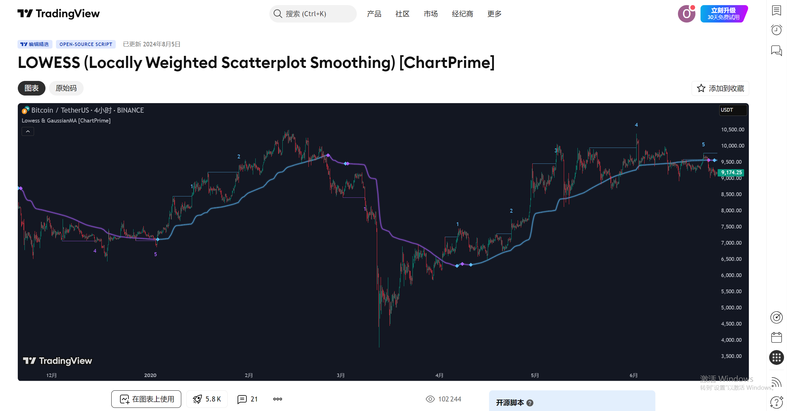
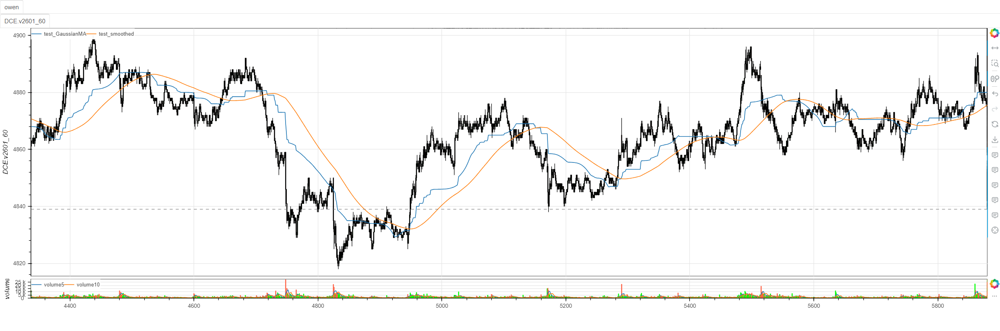

# **MiniBT量化交易之TradingView指标：LOWESS Locally Weighted Scatterplot Smoothing**

## 概述

本文将详细介绍如何将 TradingView 上的 LOWESS (Locally Weighted Scatterplot Smoothing) 指标转换为 MiniBT 框架可用的技术指标。这个由 ChartPrime 开发的指标使用局部加权回归平滑技术，结合高斯加权移动平均，提供了一个先进的趋势平滑和噪声过滤工具。

## 原策略分析

### 指标核心逻辑

1. **双阶段平滑处理**：结合高斯加权移动平均和 LOWESS 回归
2. **自适应权重计算**：基于距离和波动率的动态权重分配
3. **局部回归分析**：对每个数据点进行局部加权线性回归
4. **噪声过滤**：有效分离趋势信号与市场噪声

### 指标参数

- `length`：高斯加权窗口长度 (默认: 100)
- `malen`：LOWESS 平滑窗口长度 (默认: 100)
  



## MiniBT 转换实现

### 指标类结构

```python
class LOWESS(BtIndicator):
    """https://cn.tradingview.com/script/hyeoDyZn-LOWESS-Locally-Weighted-Scatterplot-Smoothing-ChartPrime/"""
    params = dict(length=100, malen=100)
    overlap = True
```

### 核心方法实现

#### 1. 波动率估计

```python
length = self.params.length
close = self.close.values
atr = self.atr(length)
std = self.close.stdev(length)
sigma = (atr+std)/2.
sigma = sigma.values
data = IndFrame(dict(close=close, sigma=sigma))
```

#### 2. 高斯加权移动平均计算

```python
def func(close: np.ndarray, sigma: np.ndarray):
    close = close[::-1]
    sigma = sigma[-1]
    gma = 0.
    sumOfWeights = 0.
    for i in range(length):
        h_l = close[:i+1]
        highest = h_l.max()
        lowest = h_l.min()
        weight = math.exp(-math.pow(((i - (length - 1))
                                      ) / (2 * sigma)), 2) / 2)
        value = highest+lowest
        gma = gma + (value * weight)
        sumOfWeights += weight

    return (gma / sumOfWeights) / 2.

GaussianMA = data.rolling_apply(func, length)
```

#### 3. LOWESS 局部加权回归

```python
def lowess(src: pd.Series):
    length = len(src)
    src = src.values[::-1]
    sum_w = 0.0
    sum_wx = 0.0
    sum_wy = 0.0
    for i in range(length):
        w = math.pow(1 - math.pow(i / length, 3), 3)
        sum_w += w
        sum_wx += w * i
        sum_wy += w * src[i]
    a = sum_wy / sum_w
    b = sum_wx / sum_w
    return a + b / (length - 1) / 2000.

smoothed = GaussianMA.rolling(self.params.malen).apply(lowess)
```

## 转换技术细节

### 1. 波动率估计方法

原指标使用 ATR 和标准差结合的方式估计波动率：

```python
// Calculate Sigma using ATR and Standard Deviation
atr = ta.atr(length)
stdev = ta.stdev(close, length)
sigma = (atr + stdev) / 2
```

转换代码使用 MiniBT 的内置方法实现：

```python
atr = self.atr(length)
std = self.close.stdev(length)
sigma = (atr+std)/2.
sigma = sigma.values
```

### 2. 高斯加权函数

原指标使用高斯核函数计算权重：

```python
// Gaussian Weighted Moving Average
weight = math.exp(-math.pow((i - (length - 1)) / (2 * sigma), 2) / 2)
```

转换代码实现了相同的高斯核函数：

```python
weight = math.exp(-math.pow(((i - (length - 1))
                              ) / (2 * sigma)), 2) / 2)
```

### 3. LOWESS 回归实现

原指标使用三次方权重函数进行局部加权回归：

```python
// LOWESS Smoothing
w = math.pow(1 - math.pow(i / length, 3), 3)
```

转换代码实现了相同的权重函数和回归计算：

```python
w = math.pow(1 - math.pow(i / length, 3), 3)
sum_w += w
sum_wx += w * i
sum_wy += w * src[i]
a = sum_wy / sum_w  # 截距
b = sum_wx / sum_w  # 斜率
```

### 4. 双阶段平滑流程

转换代码保持了原指标的双阶段平滑结构：

1. **第一阶段**：高斯加权移动平均，基于波动率调整权重
2. **第二阶段**：LOWESS 局部加权回归，进一步平滑曲线

```python
# 第一阶段：高斯加权移动平均
GaussianMA = data.rolling_apply(func, length)

# 第二阶段：LOWESS平滑
smoothed = GaussianMA.rolling(self.params.malen).apply(lowess)
```

## 使用示例
```python
class LOWESS(BtIndicator):
    """https://cn.tradingview.com/script/hyeoDyZn-LOWESS-Locally-Weighted-Scatterplot-Smoothing-ChartPrime/"""
    params = dict(length=100, malen=100)
    overlap = True

    def next(self):
        length = self.params.length
        close = self.close.values
        atr = self.atr(length)
        std = self.close.stdev(length)
        sigma = (atr+std)/2.
        sigma = sigma.values
        data = IndFrame(dict(close=close, sigma=sigma))

        def func(close: np.ndarray, sigma: np.ndarray):
            close = close[::-1]
            sigma = sigma[-1]
            gma = 0.
            sumOfWeights = 0.
            for i in range(length):
                h_l = close[:i+1]
                highest = h_l.max()
                lowest = h_l.min()
                weight = math.exp(-math.pow(((i - (length - 1)
                                              ) / (2 * sigma)), 2) / 2)
                value = highest+lowest
                gma = gma + (value * weight)
                sumOfWeights += weight

            return (gma / sumOfWeights) / 2.

        GaussianMA = data.rolling_apply(func, length)

        def lowess(src: pd.Series):
            length = len(src)
            src = src.values[::-1]
            sum_w = 0.0
            sum_wx = 0.0
            sum_wy = 0.0
            for i in range(length):
                w = math.pow(1 - math.pow(i / length, 3), 3)
                sum_w += w
                sum_wx += w * i
                sum_wy += w * src[i]
            a = sum_wy / sum_w
            b = sum_wx / sum_w
            return a + b / (length - 1) / 2000.

        smoothed = GaussianMA.rolling(self.params.malen).apply(lowess)

        return GaussianMA, smoothed
```
```python
from minibt import *


class owen(Strategy):

    def __init__(self):
        self.min_start_length = 300
        self.data = self.get_kline(LocalDatas.v2601_60_1, height=500)
        self.test = self.data.tradingview.LOWESS()


if __name__ == "__main__":
    Bt().run()
```


## 参数说明

1. **length**：高斯加权窗口长度
   - 影响第一阶段平滑的周期
   - 较大的值产生更平滑但滞后的信号
   - 较小的值更敏感但可能包含更多噪声

2. **malen**：LOWESS 平滑窗口长度
   - 影响第二阶段回归平滑的程度
   - 控制局部回归的观察窗口大小
   - 与 length 参数配合使用以达到最佳平滑效果

## 转换注意事项

### 1. 数据方向处理

转换代码需要正确处理数据的时间方向：

```python
# 反转数据以保持与TradingView一致的时间顺序
close = close[::-1]
src = src.values[::-1]
```

### 2. 滚动计算实现

由于涉及复杂的自定义函数，转换代码使用 rolling_apply：

```python
GaussianMA = data.rolling_apply(func, length)
smoothed = GaussianMA.rolling(self.params.malen).apply(lowess)
```

### 3. 权重计算优化

高斯权重计算需要考虑数值稳定性：

```python
weight = math.exp(-math.pow(((i - (length - 1)) / (2 * sigma)), 2) / 2)
```

### 4. 回归系数缩放

LOWESS 回归结果的缩放处理：

```python
return a + b / (length - 1) / 2000.
```

## 数学原理详解

### 1. 高斯核函数

高斯核函数用于计算距离权重：

```
w(i) = exp(-0.5 * ((i - (length-1)) / (2 * sigma))²)
```

其中：
- `i` 是当前索引位置
- `length` 是观察窗口长度
- `sigma` 是波动率估计值

### 2. 三次方权重函数

LOWESS 使用三次方权重函数：

```
w(i) = (1 - (i/length)³)³
```

这种权重函数给予近邻点更高权重，远离点权重递减。

### 3. 局部加权回归

对于每个窗口，计算加权线性回归：

```
y = a + b * x
```

其中系数通过加权最小二乘法计算：

```
a = Σ(w_i * y_i) / Σ(w_i)
b = Σ(w_i * x_i) / Σ(w_i)
```

## 策略应用场景

### 1. 趋势识别

LOWESS 平滑曲线可以清晰显示主要趋势方向：

```python
# 使用LOWESS判断趋势
trend_direction = np.where(smoothed > smoothed.shift(1), 1, -1)
```

### 2. 支撑阻力位

平滑曲线可以作为动态支撑阻力位：

```python
# 将LOWESS曲线作为动态支撑阻力
support_resistance = smoothed
```

### 3. 信号过滤

结合原始价格与平滑曲线的偏离度：

```python
# 计算价格与LOWESS的偏离度
deviation = (close - smoothed) / smoothed
overbought = deviation > 0.02
oversold = deviation < -0.02
```

### 4. 交叉信号

使用不同参数的 LOWESS 曲线生成交叉信号：

```python
# 快慢LOWESS交叉
fast_lowess = LOWESS(length=50, malen=50)
slow_lowess = LOWESS(length=100, malen=100)
golden_cross = fast_lowess > slow_lowess
death_cross = fast_lowess < slow_lowess
```

## 性能优化建议

### 1. 参数调优

针对不同品种和时间框架优化参数：

```python
# 日内交易参数
intraday_params = {'length': 50, 'malen': 50}

# 趋势跟踪参数  
trend_params = {'length': 200, 'malen': 200}

# 均值回归参数
mean_reversion_params = {'length': 20, 'malen': 20}
```

### 2. 计算优化

对于实时应用，可以优化计算效率：

```python
# 使用缓存避免重复计算
@lru_cache(maxsize=1000)
def gaussian_weight(i, length, sigma):
    return math.exp(-math.pow(((i - (length - 1)) / (2 * sigma)), 2) / 2)
```

### 3. 多时间框架确认

结合多个时间框架的 LOWESS 信号：

```python
# 多时间框架确认
daily_trend = daily_data.LOWESS(length=100, malen=100)
hourly_trend = hourly_data.LOWESS(length=50, malen=50)
confirmed_signal = (daily_trend > 0) & (hourly_trend > 0)
```

## 扩展功能

### 1. 置信区间

基于 LOWESS 残差计算置信区间：

```python
# 计算置信区间
residuals = close - smoothed
std_residual = residuals.rolling(window=20).std()
upper_band = smoothed + 2 * std_residual
lower_band = smoothed - 2 * std_residual
```

### 2. 动量指标

基于 LOWESS 斜率计算动量：

```python
# LOWESS动量
lowess_slope = smoothed.diff(5) / 5
momentum = lowess_slope.rolling(window=10).mean()
```

### 3. 波动率调整

动态调整参数基于市场波动率：

```python
# 波动率自适应参数
volatility = close.rolling(20).std() / close.rolling(20).mean()
adaptive_length = np.where(volatility > 0.02, 150, 50)
```

## 总结

LOWESS (Locally Weighted Scatterplot Smoothing) 指标通过先进的双阶段平滑技术，为交易者提供了一个强大的趋势识别和噪声过滤工具。该指标结合了高斯加权移动平均的波动率自适应特性和 LOWESS 局部加权回归的灵活性，能够在保持趋势识别能力的同时有效过滤市场噪声。

转换过程中，我们完整保留了原指标的数学核心，包括高斯核函数权重计算、三次方权重函数、局部加权线性回归等关键算法。通过 MiniBT 框架的实现，用户可以在回测系统中充分利用这一先进的平滑技术。

LOWESS 指标特别适用于：
- 趋势市场的趋势识别和跟踪
- 震荡市场的噪声过滤
- 动态支撑阻力位的识别
- 多时间框架的趋势确认

该指标的转换展示了如何将复杂的统计算法从 TradingView 移植到 MiniBT 框架，为其他高级统计指标的实现提供了有价值的参考范例。

> 风险提示：本文涉及的交易策略、代码示例均为技术演示、教学探讨，仅用于展示逻辑思路，绝不构成任何投资建议、操作指引或决策依据 。金融市场复杂多变，存在价格波动、政策调整、流动性等多重风险，历史表现不预示未来结果。任何交易决策均需您自主判断、独立承担责任 —— 若依据本文内容操作，盈亏后果概由自身承担。请务必充分评估风险承受能力，理性对待市场，谨慎做出投资选择。