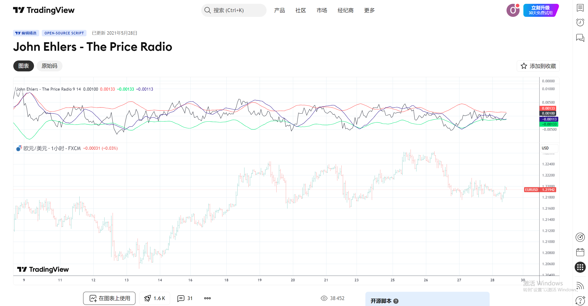
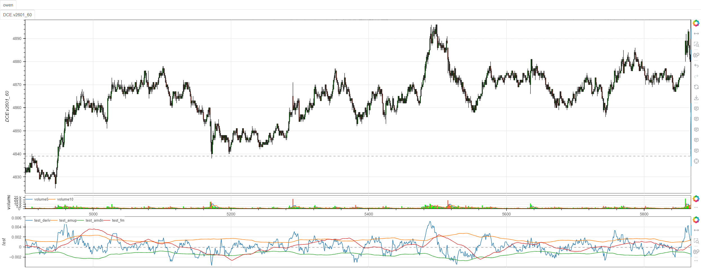

# **MiniBT量化交易之TradingView指标：John Ehlers The Price Radio**

## 概述

本文将详细介绍如何将 TradingView 上的 John Ehlers The Price Radio 指标转换为 MiniBT 框架可用的技术指标。这个由著名量化交易专家 John Ehlers 开发的指标基于信号处理理论，使用幅度调制(AM)和频率调制(FM)技术来分析价格变化率，为交易者提供独特的市场洞察。

## 原策略分析

### 指标核心逻辑

1. **价格变化率计算**：基于周期价格变化率的动量分析
2. **幅度调制(AM)**：测量价格变化率的幅度特征
3. **频率调制(FM)**：分析价格变化的频率特性
4. **信号限制处理**：使用钳制函数确保信号在合理范围内

### 指标参数

- `length`：AM/FM 计算长度 (默认: 60)
- `period`：价格变化率周期 (默认: 14)



## MiniBT 转换实现

### 指标类结构

```python
class The_Price_Radio(BtIndicator):
    """https://cn.tradingview.com/script/W5lBL0MV-John-Ehlers-The-Price-Radio/"""
    params = dict(length=60, period=14)
    overlap = False
```

### 核心方法实现

#### 1. 钳制函数 (Clamp)

```python
@staticmethod
def clamp(_value, _min, _max) -> IndSeries:
    df = IndFrame(dict(_value=_value, _min=_min, _max=_max))

    def test(_value, _min, _max):
        _t = _min if _value < _min else _value
        return _max if _t > _max else _t
    return df.rolling_apply(test, 1)
```

#### 2. 幅度调制 (AM) 计算

```python
@staticmethod
def am(_signal: IndSeries, _period) -> IndSeries:
    _envelope = _signal.abs().tqfunc.hhv(4)
    return _envelope.sma(_period)
```

#### 3. 频率调制 (FM) 计算

```python
@staticmethod
def fm(_signal: IndSeries, _period) -> IndSeries:
    _h = _signal.tqfunc.hhv(_period)
    _l = _signal.tqfunc.llv(_period)
    _hl = The_Price_Radio.clamp(10. * _signal, _l, _h)
    return _hl.sma(_period)
```

#### 4. 主计算逻辑

```python
def next(self):
    deriv = self.close.pct_change(self.params.period)
    amup = The_Price_Radio.am(deriv, self.params.length)
    amdn = -amup
    fm = The_Price_Radio.fm(deriv, self.params.length)
    return deriv, amup, amdn, fm
```

## 转换技术细节

### 1. 价格变化率计算

原指标计算价格在指定周期内的变化率：

```python
// Price Derivative (Rate of Change)
deriv = (close - close[period]) / close[period]
```

转换代码使用 MiniBT 的内置百分比变化方法：

```python
deriv = self.close.pct_change(self.params.period)
```

### 2. 幅度调制(AM)实现

幅度调制测量信号的能量或强度：

```python
// Amplitude Modulation
am(_signal, _period) =>
    _envelope = ta.highest(math.abs(_signal), 4)
    ta.sma(_envelope, _period)
```

转换代码使用 MiniBT 的高高值和移动平均方法：

```python
_envelope = _signal.abs().tqfunc.hhv(4)
return _envelope.sma(_period)
```

### 3. 频率调制(FM)实现

频率调制分析信号的变化频率：

```python
// Frequency Modulation
fm(_signal, _period) =>
    _h = ta.highest(_signal, _period)
    _l = ta.lowest(_signal, _period)
    _hl = math.max(math.min(10. * _signal, _h), _l)
    ta.sma(_hl, _period)
```

转换代码结合钳制函数和移动平均：

```python
_h = _signal.tqfunc.hhv(_period)
_l = _signal.tqfunc.llv(_period)
_hl = The_Price_Radio.clamp(10. * _signal, _l, _h)
return _hl.sma(_period)
```

### 4. 钳制函数实现

钳制函数确保数值在指定范围内：

```python
// Clamp function
clamp(_value, _min, _max) =>
    math.max(math.min(_value, _max), _min)
```

转换代码使用滚动应用实现相同的逻辑：

```python
def test(_value, _min, _max):
    _t = _min if _value < _min else _value
    return _max if _t > _max else _t
return df.rolling_apply(test, 1)
```

## 使用示例
```python
class The_Price_Radio(BtIndicator):
    """https://cn.tradingview.com/script/W5lBL0MV-John-Ehlers-The-Price-Radio/"""
    params = dict(length=60, period=14)
    overlap = False

    @staticmethod
    def clamp(_value, _min, _max) -> IndSeries:
        df = IndFrame(dict(_value=_value, _min=_min, _max=_max))

        def test(_value, _min, _max):
            _t = _min if _value < _min else _value
            return _max if _t > _max else _t
        return df.rolling_apply(test, 1)

    @staticmethod
    def am(_signal: IndSeries, _period) -> IndSeries:
        _envelope = _signal.abs().tqfunc.hhv(4)
        return _envelope.sma(_period)

    @staticmethod
    def fm(_signal: IndSeries, _period) -> IndSeries:
        _h = _signal.tqfunc.hhv(_period)
        _l = _signal.tqfunc.llv(_period)
        _hl = The_Price_Radio.clamp(10. * _signal, _l, _h)
        return _hl.sma(_period)

    def next(self):
        deriv = self.close.pct_change(self.params.period)
        amup = The_Price_Radio.am(deriv, self.params.length)
        amdn = -amup
        fm = The_Price_Radio.fm(deriv, self.params.length)
        return deriv, amup, amdn, fm
```
```python
from minibt import *


class owen(Strategy):

    def __init__(self):
        self.min_start_length = 300
        self.data = self.get_kline(LocalDatas.v2601_60_1, height=500)
        self.test = self.data.tradingview.The_Price_Radio()


if __name__ == "__main__":
    Bt().run()
```

## 参数说明

1. **period**：价格变化率周期
   - 控制计算价格变化率的时间窗口
   - 较小的值更敏感，捕捉短期动量变化
   - 较大的值更平滑，关注长期趋势变化

2. **length**：AM/FM 计算长度
   - 控制幅度和频率调制的平滑程度
   - 影响信号的稳定性和滞后性
   - 需要与 period 参数协调使用

## 转换注意事项

### 1. 静态方法使用

转换代码使用静态方法实现核心功能：

```python
@staticmethod
def clamp(_value, _min, _max) -> IndSeries:
@staticmethod
def am(_signal: IndSeries, _period) -> IndSeries:
@staticmethod
def fm(_signal: IndSeries, _period) -> IndSeries:
```

### 2. 滚动计算优化

钳制函数使用滚动应用处理向量化计算：

```python
return df.rolling_apply(test, 1)
```

### 3. 信号放大处理

FM 计算中对信号进行放大处理：

```python
_hl = The_Price_Radio.clamp(10. * _signal, _l, _h)
```

### 4. 输出信号含义

指标返回四个关键信号：
- `deriv`：原始价格变化率
- `amup`：幅度调制上边界
- `amdn`：幅度调制下边界（amup 的负值）
- `fm`：频率调制信号

## 数学原理详解

### 1. 价格变化率

价格变化率衡量价格在指定周期内的相对变化：

```
deriv = (close - close[period]) / close[period]
```

### 2. 幅度调制(AM)

幅度调制基于信号包络分析：

```
envelope = highest(abs(signal), 4)
am = sma(envelope, length)
```

### 3. 频率调制(FM)

频率调制结合极值限制和移动平均：

```
h = highest(signal, period)
l = lowest(signal, period)
hl = clamp(10 * signal, l, h)
fm = sma(hl, length)
```

### 4. 钳制函数

钳制函数确保数值在合理范围内：

```
clamp(value, min, max) = 
    if value < min then min
    else if value > max then max  
    else value
```

## 策略应用场景

### 1. 动量突破交易

使用 AM 边界作为突破信号：

```python
# AM边界突破策略
long_signal = (deriv > amup) & (deriv.shift() <= amup.shift())
short_signal = (deriv < amdn) & (deriv.shift() >= amdn.shift())
```

### 2. 趋势确认

结合 AM 和 FM 确认趋势强度：

```python
# 趋势强度确认
trend_strength = np.where(
    (deriv > 0) & (fm > fm.shift()), 
    1,  # 强势上升
    np.where(
        (deriv < 0) & (fm < fm.shift()),
        -1,  # 强势下降
        0    # 震荡或无趋势
    )
)
```

### 3. 均值回归

利用价格变化率的极值进行均值回归：

```python
# 均值回归信号
overbought = deriv > amup * 1.2
oversold = deriv < amdn * 1.2
mean_reversion_long = oversold & (fm > fm.shift())
mean_reversion_short = overbought & (fm < fm.shift())
```

### 4. 多时间框架分析

在不同时间框架应用 Price Radio：

```python
# 多时间框架确认
daily_radio = daily_data.The_Price_Radio(length=60, period=14)
hourly_radio = hourly_data.The_Price_Radio(length=30, period=7)

confirmed_bullish = (daily_radio.deriv > 0) & (hourly_radio.deriv > hourly_radio.amup)
confirmed_bearish = (daily_radio.deriv < 0) & (hourly_radio.deriv < hourly_radio.amdn)
```

## John Ehlers 方法论特点

### 1. 数字信号处理应用

Ehlers 将通信工程的信号处理技术应用于金融市场：

- **AM**：类似无线电的幅度调制，测量信号强度
- **FM**：频率调制，分析信号变化速率
- **滤波器**：各种数字滤波器消除噪声

### 2. 周期分析基础

Ehlers 方法论强调市场周期性的重要性：

```python
# 基于周期的参数设置
dominant_cycle = 20  # 假设的主导周期
optimized_period = dominant_cycle // 2
optimized_length = dominant_cycle
```

### 3. 自适应特性

指标参数可根据市场波动率自适应调整：

```python
# 波动率自适应参数
volatility = self.close.rolling(20).std() / self.close.rolling(20).mean()
adaptive_period = np.where(volatility > 0.02, 10, 20)
adaptive_length = np.where(volatility > 0.02, 40, 60)
```

## 性能优化建议

### 1. 参数敏感性分析

针对不同市场状态优化参数：

```python
# 趋势市场参数
trend_params = {'length': 80, 'period': 20}

# 震荡市场参数
range_params = {'length': 40, 'period': 10}

# 高波动率市场参数
volatile_params = {'length': 100, 'period': 5}
```

### 2. 信号过滤

添加额外的过滤条件提高信号质量：

```python
# 成交量确认
volume_filter = self.volume > self.volume.rolling(20).mean()

# 波动率过滤
volatility_filter = self.close.rolling(20).std() / self.close.rolling(20).mean() < 0.03

# 综合信号
filtered_long_signal = long_signal & volume_filter & volatility_filter
```

### 3. 组合策略

将 Price Radio 与其他 Ehlers 指标结合：

```python
# 结合其他Ehlers指标
mama, fama = self.data.indicators.mama(0.5, 0.05)
fisher = self.data.indicators.fisher_transform(10)

enhanced_signal = (deriv > amup) & (mama > fama) & (fisher > 0)
```

## 扩展功能

### 1. 信号强度指标

基于 AM 和 FM 创建综合信号强度：

```python
def signal_strength(deriv, amup, amdn, fm):
    # 幅度强度
    amp_strength = np.where(
        deriv > amup, (deriv - amup) / amup,
        np.where(deriv < amdn, (amdn - deriv) / abs(amdn), 0)
    )
    
    # 频率强度
    freq_strength = fm.pct_change(3)
    
    # 综合强度
    combined_strength = (amp_strength + freq_strength) / 2
    
    return combined_strength
```

### 2. 预警系统

创建基于 Price Radio 的市场预警：

```python
def market_alerts(deriv, amup, amdn, fm):
    alerts = []
    
    # 强势上升预警
    if deriv.iloc[-1] > amup.iloc[-1] * 1.1 and fm.iloc[-1] > fm.iloc[-2]:
        alerts.append("强势上升动量预警")
    
    # 弱势下降预警  
    if deriv.iloc[-1] < amdn.iloc[-1] * 0.9 and fm.iloc[-1] < fm.iloc[-2]:
        alerts.append("弱势下降动量预警")
        
    # 趋势转换预警
    if (deriv.iloc[-1] > 0 and deriv.iloc[-2] < 0) or (deriv.iloc[-1] < 0 and deriv.iloc[-2] > 0):
        alerts.append("趋势可能转换预警")
    
    return alerts
```

## 总结

John Ehlers 的 The Price Radio 指标通过创新的信号处理技术，为交易者提供了独特的市场分析视角。该指标结合幅度调制和频率调制，能够有效识别价格动量的强度和变化频率，在趋势识别和动量分析方面表现出色。

转换过程中，我们完整保留了 Ehlers 原版算法的数学核心，包括价格变化率计算、幅度调制、频率调制和信号钳制等关键技术。通过 MiniBT 框架的实现，用户可以在回测系统中充分利用这一先进的信号处理指标。

The Price Radio 指标特别适用于：
- 动量突破策略的信号生成
- 趋势强度和持续性的评估
- 市场状态转换的早期识别
- 多时间框架的动量确认

该指标的转换展示了如何将 John Ehlers 的高级信号处理技术从 TradingView 移植到 MiniBT 框架，为其他复杂技术指标的实现提供了重要参考。Ehlers 的方法论强调市场的周期性特征和数字信号处理的应用，这一理念在 Price Radio 指标中得到了完美体现。

> 风险提示：本文涉及的交易策略、代码示例均为技术演示、教学探讨，仅用于展示逻辑思路，绝不构成任何投资建议、操作指引或决策依据 。金融市场复杂多变，存在价格波动、政策调整、流动性等多重风险，历史表现不预示未来结果。任何交易决策均需您自主判断、独立承担责任 —— 若依据本文内容操作，盈亏后果概由自身承担。请务必充分评估风险承受能力，理性对待市场，谨慎做出投资选择。